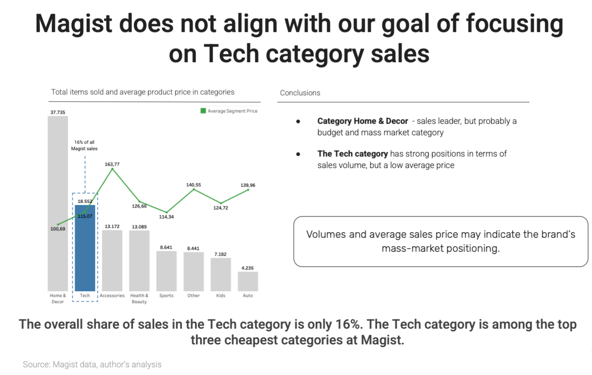
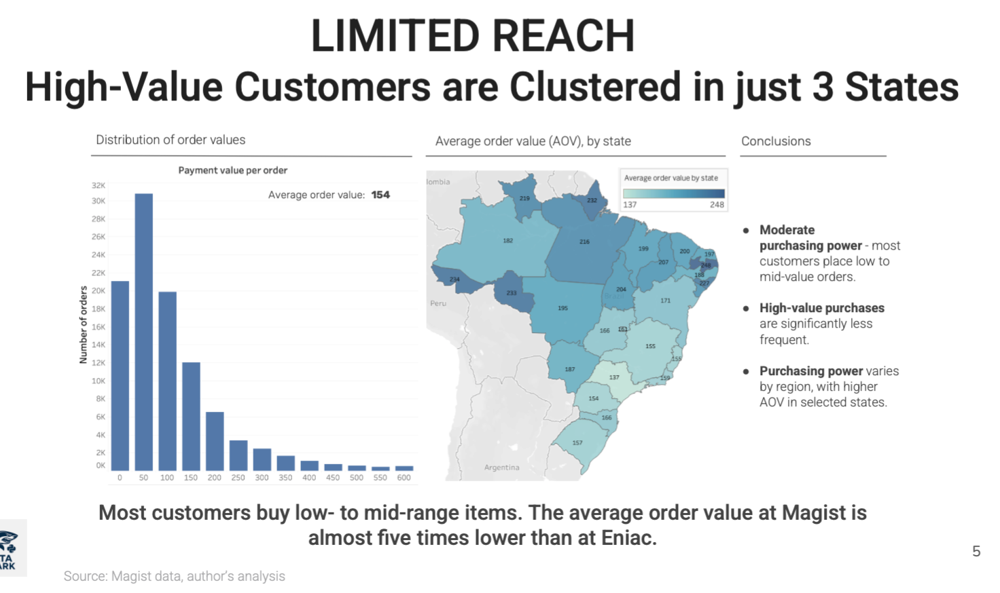
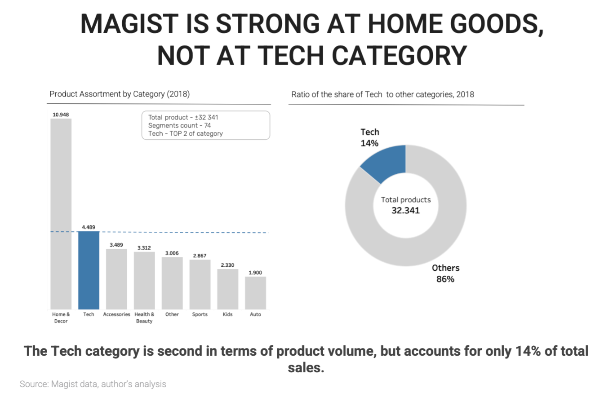

# Brazilian Market Entry Analysis: Eniac & Magist Partnership

## 📌 Project Overview
Eniac, a European tech retailer, is considering a 3-year partnership with **Magist**, a Brazilian SaaS platform, to expand into the Latin American market. 

**The Goal:** Evaluate if Magist is a suitable partner for Eniac’s high-end tech portfolio and if their logistics meet Eniac's "fast delivery" brand promise.

## 🛠️ Tech Stack
* **Language:** SQL (MySQL)
* **Visualization:** Tableau
* **Tools:** GitHub, Presentation (Slides)
* **Domain:** E-commerce, Logistics, Market Analysis

## 📊 Business Questions & Insights

### 1. Product Catalog Fit
* **Question:** Does Magist have a significant presence in the Tech sector?
* **Insight:** Analysis shows that the "Tech" segment accounts for approximately **16% of total sales**. This indicates that while the category has volume, it is among the top three cheapest categories at Magist, suggesting a mass-market rather than a premium positioning.

### 2. Geographical Reach & Purchasing Power
* **Question:** Where are the customers located and what is their buying capacity?
* **Insight:** There is a heavy concentration (**42% of orders**) in the state of **São Paulo**. Average order value (AOV) is **154 BRL**, which is significantly lower than Eniac's premium benchmarks.

### 3. Logistics & Delivery Performance
* **Question:** Can Magist deliver fast enough?
* **Insight:** Currently, only **1.38%** of deliveries meet the strict "fast delivery" expectations. The average delivery time is **14 days** compared to Eniac's **3-day target**.

*(Note: Please ensure this image reflects the logistics 3 vs 14 days chart)*

## 📂 Project Structure
* `Eniac_analysis.sql`: Contains the full SQL code for data extraction and analysis.
* `Eniac_presentation.pdf`: Visual summary of findings and final recommendations.

## 💡 Final Recommendation
**Do not sign the deal.** Magist's 14-day delivery speed and low average order value (154 BRL) directly conflict with Eniac's premium brand positioning and "3-day delivery" promise.
